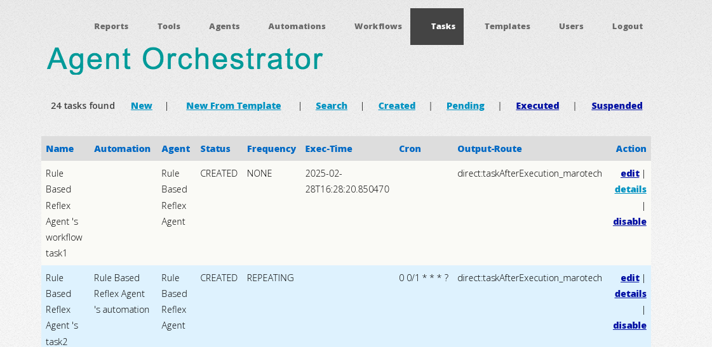
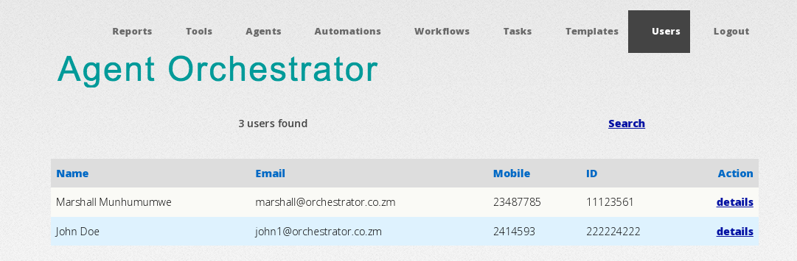
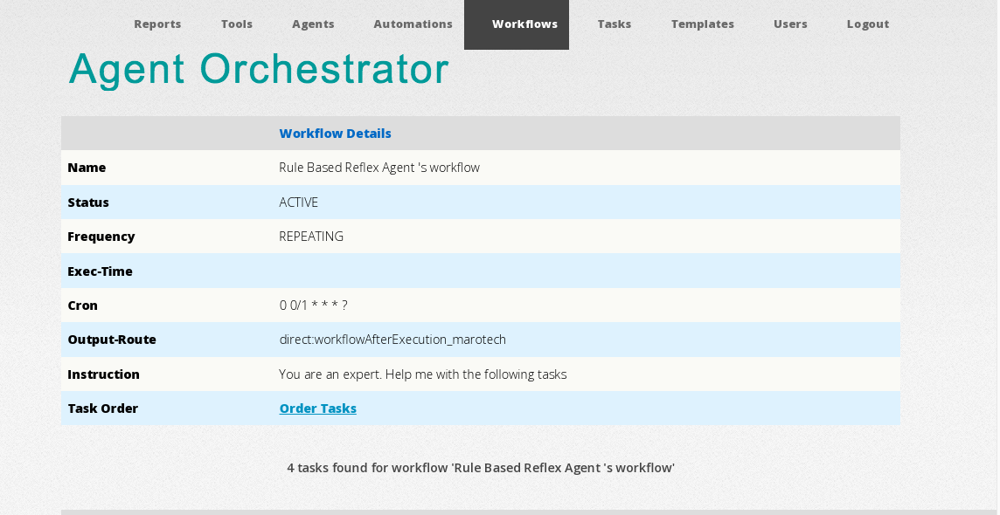
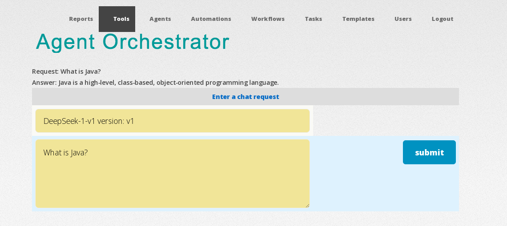

<h1 align="center"> <a href="https://github.com/nTafirei/Agent-Orchestrator">
</a>
</h1>

<h4 align="center">MaroTech AI Agent Automation Platform</h4>

<div>
    <a href="https://github.com/nTafirei/Agent-Orchestrator-Public">MaroTech</a>
 |   <a href="https://www.java.com/en/">  </a>
 |   <a href="https://spring.io/projects/spring" >  Spring</a>
 |   <a href="https://github.com/StripesFramework" > 
Stripes</a>
| <a href="https://camel.apache.org/">Apache Camel</a>
| <a href="https://activemq.apache.org/">ActiveMQ</a>
| <a href="https://kafka.apache.org/">Kafka</a>
| <a href="https://istio.io/">Istio</a>

<br>
<div class="markdown-heading" dir="auto"><h3 align="left" tabindex="-1" class="heading-element" dir="auto">Languages and Tools:</h3><a id="user-content-languages-and-tools" class="anchor" aria-label="Permalink: Languages and Tools:" href="#languages-and-tools"><svg class="octicon octicon-link" viewBox="0 0 16 16" version="1.1" width="16" height="16" aria-hidden="true"><path d="m7.775 3.275 1.25-1.25a3.5 3.5 0 1 1 4.95 4.95l-2.5 2.5a3.5 3.5 0 0 1-4.95 0 .751.751 0 0 1 .018-1.042.751.751 0 0 1 1.042-.018 1.998 1.998 0 0 0 2.83 0l2.5-2.5a2.002 2.002 0 0 0-2.83-2.83l-1.25 1.25a.751.751 0 0 1-1.042-.018.751.751 0 0 1-.018-1.042Zm-4.69 9.64a1.998 1.998 0 0 0 2.83 0l1.25-1.25a.751.751 0 0 1 1.042.018.751.751 0 0 1 .018 1.042l-1.25 1.25a3.5 3.5 0 1 1-4.95-4.95l2.5-2.5a3.5 3.5 0 0 1 4.95 0 .751.751 0 0 1-.018 1.042.751.751 0 0 1-1.042.018 1.998 1.998 0 0 0-2.83 0l-2.5 2.5a1.998 1.998 0 0 0 0 2.83Z"></path></svg></a></div>
<p align="left" dir="auto"> <a href="https://www.w3schools.com/css/" rel="nofollow"> 
 </a> <a href="https://www.docker.com/" rel="nofollow">  </a> <a href="https://git-scm.com/" rel="nofollow">  </a> <a href="https://www.w3.org/html/" rel="nofollow">  </a> <a href="https://www.java.com" rel="nofollow">  
</a> <a href="https://developer.mozilla.org/en-US/docs/Web/JavaScript" rel="nofollow"> 
 </a> <a href="https://www.postgresql.org" rel="nofollow"> 
 </a>
<a href="https://spring.io/" rel="nofollow"> 
 </a> 
<a href="https://ollama.com" target="_blank">
Ollama</a> |
<a href="https://www.deepseek.com/" target="_blank">DeepSeek</a> |
<a href="https://openai.com/" target="_blank">OpenAI</a>
</p>
<br>
<div class="markdown-heading" dir="auto"><h3 tabindex="-1" class="heading-element" dir="auto">📌Contents</h3>
<a id="user-content-contents" class="anchor" aria-label="Permalink: 📌Contents" href="#contents"><svg class="octicon octicon-link" 
viewBox="0 0 16 16" version="1.1" width="16" height="16" aria-hidden="true">
<path d="m7.775 3.275 1.25-1.25a3.5 3.5 0 1 1 4.95 4.95l-2.5 2.5a3.5 3.5 0 0 1-4.95 0 .751.751 0 0 1 .018-1.042.751.751 0 0 1 1.042-.018 1.998 1.998 0 0 0 2.83 0l2.5-2.5a2.002 2.002 0 0 0-2.83-2.83l-1.25 1.25a.751.751 0 0 1-1.042-.018.751.751 0 0 1-.018-1.042Zm-4.69 9.64a1.998 1.998 0 0 0 2.83 0l1.25-1.25a.751.751 0 0 1 1.042.018.751.751 0 0 1 .018 1.042l-1.25 1.25a3.5 3.5 0 1 1-4.95-4.95l2.5-2.5a3.5 3.5 0 0 1 4.95 0 .751.751 0 0 1-.018 1.042.751.751 0 0 1-1.042.018 1.998 1.998 0 0 0-2.83 0l-2.5 2.5a1.998 1.998 0 0 0 0 2.83Z"></path></svg></a></div>

The MaroTech Agent Automation Platform is an AI automation and workflow management system.
It solves the problem of orchestrating and controlling multiple cross-organisational 
AI agents – removing complexity, securing control, and enabling businesses to thrive in the AI age.
<p>
<br/>Tl;dr
<br/>
Download <a href="https://github.com/nTafirei/Agent-Orchestrator-Public/blob/master/dist.zip">dist.zip</a>
<br/>
Unpack the distribution
<br/>
cd {ROOT_DIR}/tomcat11/bin <br/>
startup.sh ('Nix platforms) <br/>
or<br/>
startup.bat (Windows)<br/>
<br/>
The application is available at
<a href="http://localhost:8080/orchestrator/web/login" target="_blank">http://localhost:8080/orchestrator/web/login</a>
<br/>
Demo credentials are hard coded on the login page at the bottom
<br/>
You can view the logs in {ROOT_DIR}/tomcat11/logs/catalina.out
<br/>
</p>
<p dir="auto">🚀 <a href="#-getting-started">How to start</a><br>
💡 <a href="#screenshots">Application screenshots</a><br>

<a name="getting-started">How to start</a>
<br/><br/>
Runtime Dependencies:
<br/>
Java 17
<br/>
HSQLDB, MYSQL or PostGreSQL (I use MYSQL 8 and PostGreSQL 17, but HSQLDB is used for quick demos)
<br/>
Here are the maven coordinates<br/><br/>

``` 
        <dependency>
            <groupId>hsqldb</groupId>
            <artifactId>hsqldb</artifactId>
            <version>2.7.4</version>
        </dependency>
        <dependency>
            <groupId>mysql</groupId>
            <artifactId>mysql-connector-java</artifactId>
            <version>8.0.18</version>
        </dependency>
        <dependency>
            <groupId>org.postgresql</groupId>
            <artifactId>postgresql</artifactId>
            <version>>42.7.5</version>
        </dependency>
``` 
The demo configuration is HSQLDB<br/>
You can manage all database related configurations in <br/>
{ROOT_DIR}/tomcat11/webapps/orchestrator/WEB-INF/classes/spring-config.xml<br/>
and
{ROOT_DIR}/tomcat11/webapps/orchestrator/WEB-INF/classes/{PLATFORM}-hikari.properties <br/>
(e.g. {ROOT_DIR}/tomcat11/webapps/orchestrator/WEB-INF/classes/mysql-hikari.properties)<br/>
<br/>
and<br/>
{ROOT_DIR}/tomcat11/webapps/orchestrator/WEB-INF/classes/{PLATFORM}-spring-db.xml<br/>
(e.g. {ROOT_DIR}/tomcat11/webapps/orchestrator/WEB-INF/classes/mysql-spring-db.xml)<br/>
<br/>

For HSQLDB (default for demo), the properties are in:<br/>

{ROOT_DIR}/tomcat11/webapps/orchestrator/WEB-INF/classes/hsqldb-spring-db.xml and <br/>
{ROOT_DIR}/tomcat11/webapps/orchestrator/WEB-INF/classes/hsqldb-hikari.properties
<br/>
jdbcUrl=jdbc:hsqldb:orchestrator <br/>
username=orchestrator_user <br/>
password=orchestrator_user<br/>
driverClassName=org.hsqldb.jdbc.JDBCDriver<br/>
<br/>

If you choose to use MYSQL or PostGreSQL, then <br/>
Create a database using the settings in <br/>
{ROOT_DIR}/tomcat11/webapps/orchestrator/WEB-INF/classes/mysql-hikari.properties or <br/>
{ROOT_DIR}/tomcat11/webapps/orchestrator/WEB-INF/classes/postgres-hikari.properties<br/>
<br/>

To change the database platform, change this line
``` 
   <import resource="hsqldb-spring-db.xml"/>
``` 
in {ROOT_DIR}/tomcat11/webapps/orchestrator/WEB-INF/classes/spring-config.xml

<br/>
Next
<br/>
   cd {ROOT_DIR}/tomcat11/bin <br/>
   startup.sh ('Nix platforms) <br/>
   or<br/>
   startup.bat (Windows)<br/>
<br/>
<br/>
The application is available at 
<a href="http://localhost:8080/orchestrator/web/login" target="_blank">http://localhost:8080/orchestrator/web/login</a>
<br/>
Demo credentials are hard coded on the login page at the bottom
<br/>
You can view the logs in {ROOT_DIR}/tomcat11/logs/catalina.out
<br/><br/>
Service Dependencies<br/>
For demo, you can do without installing Ollama server. However, you will have a mock
language model interacting with the application. <br/>
Install Ollama server to have a real language model to interact with the application.
See<br/>
https://ollama.com/download
<br/> and <br/>
https://medium.com/@vvsvish/how-to-secure-ollama-server-64cde5e59971
<br/>
Ollama Config<br/>
In {ROOT_DIR}/tomcat11/webapps/orchestrator/WEB-INF/classes/config.properties<br/>
these are the properties that you can change to control server settings and 
which language model to use <br/>
platform.language.service.option=mock (change to ollama for the real service)<br/>
platform.ollama.host=http://localhost:11434/ollama
<br/>
see https://github.com/ollama4j/ollama4j/blob/main/src/main/java/io/github/ollama4j/types/OllamaModelType.java <br/>
for all the available options
<br/><br/>
Warnings and Limitations
<br/>
Vector embeddings for RAG are currently only available for PostGreSQL with pg_vector<br/>
<a href="https://github.com/pgvector/pgvector">https://github.com/pgvector/pgvector</a>
<br/>
<br/>
Sample Prompts
<br/>
   <a href="docs/business-plan.txt" target="_blank">Business Plan Prompt</a>
<br/>
   <a href="docs/competitor-analysis.txt" target="_blank">Competitor Analysis Prompt</a>
<br/>
   <a href="docs/business-plan.txt" target="_blank">Business Plan Prompt</a>
<br/>
   <a href="docs/essay-writer.txt" target="_blank">Essay Writer Prompt</a>
<br/>
   <a href="docs/market-research.txt" target="_blank">Market Research Prompt</a>
<br/>
   <a href="docs/stock-research.txt" target="_blank">Stock Research Prompt</a>
<br/>
<br/>
<a name="screenshots">Application screenshots</a>
<br/><br/>
	
		

			
	

	
		

				

				

<br/>
<br/>
<strong>What is Task Automation and what is an AI Agent? </strong>
<br/>
Task Automation and AI Agents are two related but distinct concepts in the field of artificial
intelligence and 
automation. Here's a breakdown of the differences:

<br/>
<strong>Task Automation</strong>
<br/>
Task automation refers to the use of technology to automate repetitive, mundane, 
or time-consuming tasks.<br/> 
The primary goal is to increase efficiency, reduce manual labor, and improve accuracy.

<br/>
<strong>Characteristics</strong>
<br/>
Rule-based: Automation is typically based on predefined rules or scripts.
<br/>
Repetitive tasks: Automation focuses on automating specific, repetitive tasks.
<br/>
Limited decision-making: Automation systems typically don't make complex decisions or 
adapt to new situations.

<br/><br/>
<strong>AI Agent</strong>
<br/>
An AI agent, on the other hand, is a software system that uses artificial intelligence to 
perform tasks that 
typically require human intelligence.
<br/>
AI agents can perceive their environment, reason, and take actions to achieve specific goals.

<br/>
<strong>Characteristics</strong>
<br/>
Intelligent decision-making: AI agents can make complex decisions based on data analysis, machine learning, 
and problem-solving.
<br/>
Autonomy:
<br/>
AI agents can operate independently, adapting to new situations and learning from experience.
<br/>
Flexibility: AI agents can handle a wide range of tasks, from simple to complex, 
and can be integrated with 
various systems and data sources.

<br/>
Key differences
<br/>
Scope: Task automation focuses on automating specific tasks, while AI agents have a broader scope, 
encompassing multiple tasks and decision-making processes.
<br/>
Intelligence: AI agents possess artificial intelligence, enabling them to reason, 
learn, and adapt,
whereas task automation relies on predefined rules and scripts.
<br/>
Autonomy: AI agents operate independently, while task automation typically requires 
human oversight and intervention.
<br/>
To illustrate the difference, consider a customer service chat bot:
Task automation would involve automating specific tasks, such as responding to
frequently asked questions or 
routing customer inquiries.
<br/>
An AI agent, on the other hand, would use natural language processing (NLP) 
and machine learning to understand 
customer inquiries, provide personalized responses, and even escalate complex issues 
to human representatives.
<br/>
This platform addresses both of these areas
<br/><br/>

There are several types of AI agents, each with distinct characteristics and capabilities. 
Here are some of the main types:
<br/><br/>
1. Simple Reflex Agents<br/>
   React to current state of the environment<br/>
   No internal state or memory<br/>
   Limited decision-making capabilities<br/>
   Examples: Thermostats, Automatic Door Openers<br/>
2. Model-Based Reflex Agents<br/>
   Maintain internal models of the environment<br/>
   Use these models to make decisions<br/>
   Can handle partially observable environments<br/>
   Examples: Autonomous Vacuum Cleaners, Self-Driving Cars<br/>
3. Goal-Based Agents<br/>
   Have specific goals to achieve<br/>
   Use planning and decision-making to achieve goals<br/>
   Can handle complex, dynamic environments<br/>
   Examples: Personal Assistants, Recommendation Systems<br/>
4. Utility-Based Agents
   Make decisions based on utility functions<br/>
   Choose actions that maximize expected utility<br/>
   Can handle uncertain, dynamic environments<br/>
   Examples: Game-Playing Agents, Financial Trading Agents<br/>
5. Learning Agents<br/>
   Learn from experience and adapt to new situations<br/>
   Use machine learning algorithms to improve performance<br/>
   Can handle complex, dynamic environments<br/>
   Examples: Chatbots, Image Recognition Systems<br/>
6. Reactive Agents<br/>
   React to changes in the environment<br/>
   Use sensors and actuators to interact with the environment<br/>
   Can handle real-time, dynamic environments<br/>
   Examples: Autonomous Robots, Process Control Systems<br/>
</div>
